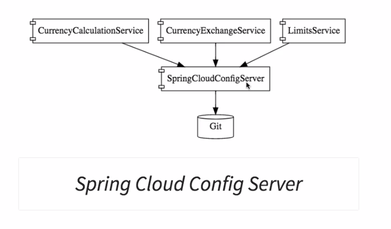

# Config Properties

From Spring initializer

* Web
* DevTools
* Actuator
* Config Client (to talk to the Spring cloud Config Server)

### Branches

feature-0-hardcoded config
* maximum: 999,
* minimum: 1

feature-1-configuration

(moving the hardcoded values into application.xml)
* maximum: 99,
* minimum: 7